# Biomedical Domain Map — 2026

A graph of what connects to the term **"biomedical."** The limb structure and naming
are durable; the items marked **`*`** (and shaded in the diagram) are the 2026 snapshot
and will drift within a year. AI/ML is drawn as a _cross-cutting force_ touching every
limb, not as a single branch.

> Scope note: this is a conceptual/landscape map (bucket B). It is grounded in current
> sources for the 2026-specific items; the limb skeleton itself is definitional.

---

## Graph

```mermaid
graph LR
    BM["Biomedical (2026)"]

    BM --> FOUND["Foundational Sciences"]
    FOUND --> BIO["Biology"]
    FOUND --> CHEM["Biochemistry"]
    FOUND --> PHYS["Biophysics"]
    FOUND --> SYSBIO["Systems Biology *"]

    BM --> ENG["Biomedical Engineering"]
    ENG --> BIOMAT["Biomaterials / Smart Nanomaterials *"]
    ENG --> TISSUE["Tissue Eng / 3D Bioprinting *"]
    ENG --> BIOELEC["Bioelectronics / Soft Robotics *"]
    ENG --> LOC["Lab-on-Chip / Organ-on-Chip *"]
    ENG --> IMGdev["Imaging Instrumentation"]

    BM --> INFO["Biomedical Informatics (AMIA)"]
    INFO --> EHR["EHR"]
    INFO --> CDS["Clinical Decision Support"]
    INFO --> ONTO["Ontologies / Standards (FHIR, SNOMED, UMLS)"]
    INFO --> FMODELS["Foundation / Multimodal Models, Agentic Systems *"]

    BM --> RESEARCH["Biomedical Research"]
    RESEARCH --> GENOM["Genomics"]
    RESEARCH --> PROT["Proteomics"]
    RESEARCH --> PHARM["Pharmacology"]
    RESEARCH --> TRANS["Translational Medicine"]
    RESEARCH --> DTWIN["Digital Twins *"]

    BM --> THER["Therapeutics & Interventions"]
    THER --> DRUG["Drug Discovery *"]
    THER --> GENED["Genome Editing: N-of-1, Prime Editing *"]
    THER --> CELLGENE["Cell & Gene Therapy *"]
    THER --> DEGRAD["Molecular Glues / Degradation *"]

    BM --> CLIN["Clinical Practice"]
    CLIN --> SPECS["Specialties (Critical Care, Radiology, Pathology)"]
    CLIN --> DIAG["Point-of-Care Diagnostics *"]
    CLIN --> WEAR["Wearables / Continuous Monitoring *"]
    CLIN --> SAMD["Software as Medical Device *"]

    BM --> PH["Public Health & Epidemiology"]
    PH --> SURV["Wastewater / Genomic Surveillance *"]
    PH --> PRECPH["Precision Public Health *"]
    PH --> BIOSTAT["Biostatistics"]
    PH --> DATASTRAT["Public Health Data Modernization *"]

    BM --> DATA["Data & Methods"]
    DATA --> OMICS["Multi-omics"]
    DATA --> SPATIAL["Spatial Biology (commercial scale) *"]
    DATA --> BIOINF["Bioinformatics"]

    BM --> GOV["Regulatory, Ethics & Governance"]
    GOV --> REG["Regulatory: AI credibility, AI in IND/BLA *"]
    GOV --> IRB["IRB / Ethics / GCP"]
    GOV --> REPRO["Reproducibility / Data Governance *"]
    GOV --> FUND["Funding Environment (US NIH/NSF cuts) *"]

    AIX{{"AI / ML — cross-cutting force across all limbs"}}
    AIX -.-> FMODELS
    AIX -.-> TISSUE
    AIX -.-> SURV
    AIX -.-> DRUG
    AIX -.-> BIOMAT
    AIX -.-> DTWIN
    AIX -.-> SPATIAL
    AIX -.-> DIAG

    classDef hot fill:#ff6b35,stroke:#cc4419,color:#fff;
    classDef crosscut fill:#2d6cdf,stroke:#1a4ba8,color:#fff;
    class SYSBIO,BIOMAT,TISSUE,BIOELEC,LOC,FMODELS,DTWIN,DRUG,GENED,CELLGENE,DEGRAD,DIAG,WEAR,SAMD,SURV,PRECPH,DATASTRAT,SPATIAL,REG,REPRO,FUND hot;
    class AIX crosscut;
```

`*` = live 2026 movement (snapshot layer) · blue node = cross-cutting force

---

## Taxonomy (outline form)

- **Foundational Sciences** — Biology · Biochemistry · Biophysics · Systems Biology `*`
- **Biomedical Engineering** — Biomaterials / Smart Nanomaterials `*` · Tissue Eng / 3D Bioprinting `*` · Bioelectronics / Soft Robotics `*` · Lab-on-Chip / Organ-on-Chip `*` · Imaging Instrumentation
- **Biomedical Informatics (AMIA)** — EHR · Clinical Decision Support · Ontologies / Standards (FHIR, SNOMED, UMLS) · Foundation / Multimodal Models, Agentic Systems `*`
- **Biomedical Research** — Genomics · Proteomics · Pharmacology · Translational Medicine · Digital Twins `*`
- **Therapeutics & Interventions** — Drug Discovery `*` · Genome Editing (N-of-1, Prime Editing) `*` · Cell & Gene Therapy `*` · Molecular Glues / Targeted Degradation `*`
- **Clinical Practice** — Specialties (Critical Care, Radiology, Pathology) · Point-of-Care Diagnostics `*` · Wearables / Continuous Monitoring `*` · Software as Medical Device `*`
- **Public Health & Epidemiology** — Wastewater / Genomic Surveillance `*` · Precision Public Health `*` · Biostatistics · Public Health Data Modernization `*`
- **Data & Methods** — Multi-omics · Spatial Biology (commercial scale) `*` · Bioinformatics
- **Regulatory, Ethics & Governance** — Regulatory (AI credibility, AI in IND/BLA) `*` · IRB / Ethics / GCP · Reproducibility / Data Governance `*` · Funding Environment (US NIH/NSF cuts) `*`
- **AI / ML** _(cross-cutting)_ — pushes into informatics, engineering, public health, research, therapeutics, diagnostics, and data simultaneously

---

## 2026 evidence notes

| Limb          | What's moving                                                                                                   | Source signal                              |
| ------------- | --------------------------------------------------------------------------------------------------------------- | ------------------------------------------ |
| Engineering   | CRISPR-based biosensors, smart nanomaterials, lab-on-chip point-of-care diagnostics; AI-driven 3D bioprinting   | Case Western / MDPI Biomedicines 2026      |
| Informatics   | Foundation/multimodal models, agentic systems, digital twins                                                    | JBHI special issues; CVPR 2026 MMFM-BIOMED |
| Therapeutics  | N-of-1 personalized editing, prime editing human validation, molecular glues displacing PROTACs                 | 2026 therapeutic-trend reporting           |
| Data / Omics  | Spatial transcriptomics at commercial scale                                                                     | Industry launch reporting 2026             |
| Public Health | Wastewater-based epidemiology coupled with ML; mass-gathering deployment (2026 FIFA WC); CDC data modernization | Science; ScienceDirect 2026; CDC PHDS      |
| Governance    | FDA AI-credibility guidance, AI in IND/BLA; US NIH/NSF funding cuts reshaping where work happens                | 2025–26 regulatory + funding reporting     |

---

## Honest limitations

1. **Skeleton vs. snapshot.** Limb names and hierarchy are durable; `*` items are a 2026
   snapshot and will move within a year.
2. **Presence, not intensity.** Hotspots are marked binary (live / not). These searches
   establish _that_ a branch is active, not _how_ active relative to others. True weighting
   (node size or gradient by publication/funding volume) needs a separate quantitative pass.
3. **Geographic skew.** Funding and regulatory signals lean US-centric in the sources found;
   EU/Asia dynamics are under-sampled here.
